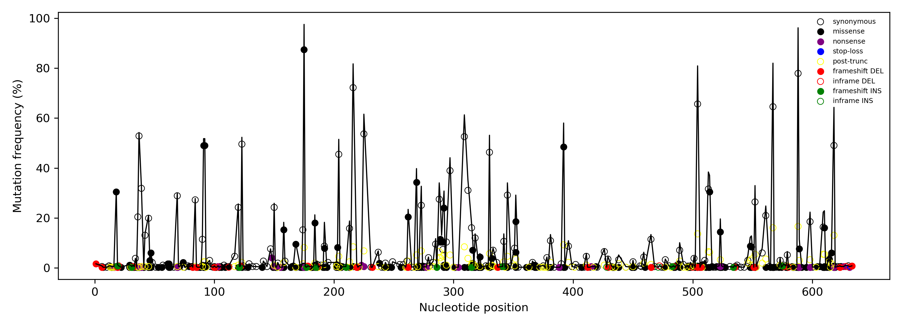
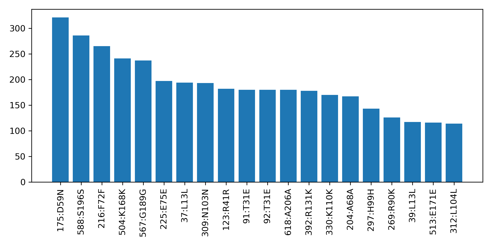

# Gene Mutation Analysis Pipeline

A lightweight end-to-end pipeline for extracting a target gene from multiple genomes, aligning codon-aware sequences, and calling nucleotide/amino-acid mutations with frequency summaries.

## Input Files

The workflow requires two input FASTA files:

1. **Reference gene FASTA** (`gene.fa`)

   * Contains *only the target gene* sequence.
   * This is treated as the reference used for alignment and mutation calling.

2. **Multi‑genome FASTA** (`genomes.fa`)

   * Contains multiple whole genomes or contigs.
   * The pipeline extracts the best-matching region corresponding to the reference gene from each genome.
   * These extracted sequences become the input for codon-aware alignment and mutation analysis.

## Features

* BLAST-based gene extraction
* Reverse-complement and coordinate handling
* MAFFT codon-aware alignment
* SNP/INS/DEL detection
* Amino-acid mutation classification (missense, synonymous, LOF, truncation, stop-loss)
* Position-based frequency tables
* Event-level mutation summaries
* Plotting of mutation frequencies and top events
* Modular, script-based workflow

## Requirements

### System dependencies

* MAFFT
* BLAST+ (makeblastdb, blastn)
* Python 3.8+

Install via conda/mamba:

```
conda install -c bioconda mafft blast
```

### Python dependencies

```
pip install -r requirements.txt
```

## Workflow

Example usage:

```
./workflow.sh
```

This produces:

```

output_prefix_nt_aa_events.csv
output_prefix_nt_position_counts.csv
output_prefix_effect_counts.csv
output_prefix_pos_frequency_by_effect.png
output_prefix_top_effects.png

```

## Graph Outputs

The plotting script (`analysis.py`) produces two figures summarising mutation frequencies.

### 1. Per-position mutation frequency
File: `<base>_pos_frequency_by_effect.png`

Shows total mutation frequency at each nucleotide position with individual mutation events overlaid. Colours and markers in the figure correspond directly to mutation types.

### Per-position mutation frequency



### 2. Top mutation events

File: `<base>_top_effects.png`

A bar plot showing the highest-count mutation events, labelled by nucleotide position and amino-acid mutation.

### Top events




## Output Files

- `_nt_aa_events.csv` – Full mutation table with SNP/INS/DEL calls and amino-acid effects.
- `_nt_position_counts.csv` – Count of mutations at each nucleotide position.
- `_effect_counts.csv` – `(Position, Event, Effect, AA_Mutation) → Count` summary.
- PNG figures – Mutation frequency plot and top-events barplot.
